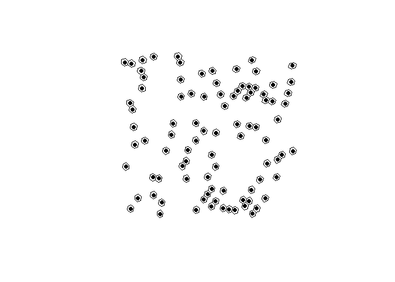

# h3o

<!-- badges: start -->

[](https://github.com/JosiahParry/h3o/actions/workflows/R-CMD-check.yaml)

<!-- badges: end -->

`{h3o}` is a lightweight R package for interacting with [Uber’s H3
Geospatial Indexing system](https://github.com/uber/h3). The R package
uses [extendr](https://extendr.github.io/) to wrap the eponymous [h3o
Rust crate](https://crates.io/crates/h3o), which offers a pure Rust
implementation of H3, so no linking to Uber’s H3 C library. The package
is also intended to work with the
[`{sf}`](https://github.com/r-spatial/sf) package for geometric
operations and as a bonus represents the H3 class as
[`{vctrs}`](https://github.com/r-lib/vctrs), so they work seamlessly
within a tidyverse workflow.

## Installation

You can install the release version of `{h3o}` from CRAN with:

``` r
install.packages("h3o")
```

Or you can install the development version from
[GitHub](https://github.com/) with:

``` r
# install.packages("pak")
pak::pak("JosiahParry/h3o")
```

## Example

H3 vectors can be created from `POINT` geometry columns (`sfc` objects)
defined by sf.

``` r
library(h3o)
library(dplyr)
library(sf)
library(tibble)

xy <- data.frame(
  x = runif(100, -5, 10),
  y = runif(100, 40, 50)
)

pnts <- st_as_sf(
  xy,
  coords = c("x", "y"),
  crs = 4326
)

pnts |> mutate(h3 = h3_from_points(geometry, 5))
#> Simple feature collection with 100 features and 1 field
#> Geometry type: POINT
#> Dimension:     XY
#> Bounding box:  xmin: -4.687389 ymin: 40.09688 xmax: 9.911612 ymax: 49.97784
#> Geodetic CRS:  WGS 84
#> First 10 features:
#>                      geometry              h3
#> 1   POINT (4.504552 45.26616) 851f93d7fffffff
#> 2   POINT (1.816329 40.94935) 853946abfffffff
#> 3  POINT (-2.147328 46.43598) 85184183fffffff
#> 4   POINT (3.260273 41.34728) 853940a3fffffff
#> 5   POINT (-1.50323 46.38411) 85186a53fffffff
#> 6  POINT (0.1499664 42.05342) 85397567fffffff
#> 7   POINT (4.900316 41.40955) 85394cdbfffffff
#> 8  POINT (-1.195541 46.94178) 85186e6bfffffff
#> 9   POINT (9.911612 49.19627) 851faa37fffffff
#> 10 POINT (-3.434653 45.27516) 85184ecffffffff
```

H3 vectors also have an `st_as_sfc()` method which allows conversion of
H3 cell indexes into sf `POLYGON`s.

``` r
# replace geometry
h3_cells <- pnts |>
  mutate(
    h3 = h3_from_points(geometry, 4),
    geometry = st_as_sfc(h3)
  )

# plot the hexagons
plot(st_geometry(h3_cells))
```


H3 cell centroids can be returned using `h3_to_points()`. If `sf` is
avilable, the results will be returned as an `sfc` (sf column) object.
Otherwise it will return a list of `sfg` (sf geometries).

``` r
# fetch h3 column
h3s <- h3_cells[["h3"]]

# get there centers
h3_centers <- h3_to_points(h3s)

# plot the hexagons with the centers
plot(st_geometry(h3_cells))
plot(h3_centers, pch = 16, add = TRUE, col = "black")
```



`H3Edge` vectors representing the boundaries of H3 cells can be created
with `h3_edges()`, `h3_shared_edge_pairwise()`, and
`h3_shared_edge_sparse()`.

``` r
cell_edges <- h3_edges(h3s[1:3])
cell_edges
#> [[1]]
#> <H3Edge[6]>
#> [1] 1141f93dffffffff 1241f93dffffffff 1341f93dffffffff 1441f93dffffffff
#> [5] 1541f93dffffffff 1641f93dffffffff
#> 
#> [[2]]
#> <H3Edge[6]>
#> [1] 1143946bffffffff 1243946bffffffff 1343946bffffffff 1443946bffffffff
#> [5] 1543946bffffffff 1643946bffffffff
#> 
#> [[3]]
#> <H3Edge[6]>
#> [1] 11418419ffffffff 12418419ffffffff 13418419ffffffff 14418419ffffffff
#> [5] 15418419ffffffff 16418419ffffffff
```

We’ve created a list of each cell’s edges. We can flatten them using
`flatten_edges()`.

``` r
cell_edges <- flatten_edges(cell_edges)
cell_edges
#> <H3Edge[18]>
#>  [1] 1141f93dffffffff 1241f93dffffffff 1341f93dffffffff 1441f93dffffffff
#>  [5] 1541f93dffffffff 1641f93dffffffff 1143946bffffffff 1243946bffffffff
#>  [9] 1343946bffffffff 1443946bffffffff 1543946bffffffff 1643946bffffffff
#> [13] 11418419ffffffff 12418419ffffffff 13418419ffffffff 14418419ffffffff
#> [17] 15418419ffffffff 16418419ffffffff
```

These can be cast to sfc objects using `st_as_sfc()`.

``` r
st_as_sfc(cell_edges)
#> Geometry set for 18 features 
#> Geometry type: LINESTRING
#> Dimension:     XY
#> Bounding box:  xmin: -2.518472 ymin: 40.84516 xmax: 4.818449 ymax: 46.60887
#> Geodetic CRS:  WGS 84
#> First 5 geometries:
#> LINESTRING (4.748771 44.94225, 4.818449 45.17055)
#> LINESTRING (4.201051 44.99631, 4.440499 44.85539)
#> LINESTRING (4.440499 44.85539, 4.748771 44.94225)
#> LINESTRING (4.578042 45.31175, 4.268915 45.22437)
#> LINESTRING (4.818449 45.17055, 4.578042 45.31175)
```

Additionally, you can get the vertexes of H3 cell indexes using
`h3_to_vertexes()` which returns an `sfc_MULTIPOINT`.

``` r
h3_to_vertexes(h3s)
#> Geometry set for 100 features 
#> Geometry type: MULTIPOINT
#> Dimension:     XY
#> Bounding box:  xmin: -5.049869 ymin: 39.94716 xmax: 10.37721 ymax: 50.35027
#> Geodetic CRS:  WGS 84
#> First 5 geometries:
#> MULTIPOINT ((4.268915 45.22437), (4.201051 44.9...
#> MULTIPOINT ((1.563896 41.22113), (1.508041 40.9...
#> MULTIPOINT ((-2.164091 46.60887), (-2.470648 46...
#> MULTIPOINT ((2.941338 41.43962), (2.880845 41.2...
#> MULTIPOINT ((-1.602187 46.52355), (-1.907502 46...
```

## Bench marks

Since h3o is written in Rust, it is very fast.

### Creating polygons

``` r
h3_strs <- as.character(h3s)
bench::mark(
  h3o = st_as_sfc(h3s),
  h3jsr = h3jsr::cell_to_polygon(h3_strs)
)
#> # A tibble: 2 × 6
#>   expression      min   median `itr/sec` mem_alloc `gc/sec`
#>   <bch:expr> <bch:tm> <bch:tm>     <dbl> <bch:byt>    <dbl>
#> 1 h3o         432.3µs  477.7µs     1972.    9.85KB     14.6
#> 2 h3jsr        8.19ms   8.83ms      110.    2.69MB     89.4
```

### Converting polygons to H3 cells:

``` r
nc <- st_read(system.file("gpkg/nc.gpkg", package = "sf"), quiet = TRUE) |>
  st_transform(4326) |>
  st_geometry()

bench::mark(
  h3o = sfc_to_cells(nc, 5, "centroid"),
  h3jsr = h3jsr::polygon_to_cells(nc, 5),
  check = FALSE
)
#> # A tibble: 2 × 6
#>   expression      min   median `itr/sec` mem_alloc `gc/sec`
#>   <bch:expr> <bch:tm> <bch:tm>     <dbl> <bch:byt>    <dbl>
#> 1 h3o          4.96ms   5.29ms     185.     21.4KB    11.2 
#> 2 h3jsr       28.79ms   29.5ms      33.8   748.7KB     5.19
```

### Converting points to cells

``` r
bench::mark(
  h3o = h3_from_points(pnts$geometry, 3),
  h3jsr = h3jsr::point_to_cell(pnts$geometry, 3),
  check = FALSE
)
#> # A tibble: 2 × 6
#>   expression      min   median `itr/sec` mem_alloc `gc/sec`
#>   <bch:expr> <bch:tm> <bch:tm>     <dbl> <bch:byt>    <dbl>
#> 1 h3o         105.2µs  124.5µs     7114.      848B    11.7 
#> 2 h3jsr        2.57ms   2.96ms      329.     975KB     8.49
```

### Retrieve edges

``` r
bench::mark(
  h3o = h3_edges(h3s),
  h3jsr = h3jsr::get_udedges(h3_strs),
  check = FALSE
)
#> # A tibble: 2 × 6
#>   expression      min   median `itr/sec` mem_alloc `gc/sec`
#>   <bch:expr> <bch:tm> <bch:tm>     <dbl> <bch:byt>    <dbl>
#> 1 h3o         351.7µs  509.5µs     1674.      848B     13.1
#> 2 h3jsr        1.72ms   2.88ms      363.    67.9KB     16.2
```

### Get origins and destinations from edges.

``` r
# get edges for a single location
eds <- h3_edges(h3s[1])[[1]]
# strings for h3jsr
eds_str <- as.character(eds)

bench::mark(
  h3o = h3_edge_cells(eds),
  h3jsr = h3jsr::get_udends(eds_str),
  check = FALSE
)
#> # A tibble: 2 × 6
#>   expression      min   median `itr/sec` mem_alloc `gc/sec`
#>   <bch:expr> <bch:tm> <bch:tm>     <dbl> <bch:byt>    <dbl>
#> 1 h3o          14.3µs     22µs    40992.    7.86KB     16.4
#> 2 h3jsr       646.1µs    741µs     1250.   19.82KB     15.4
```
