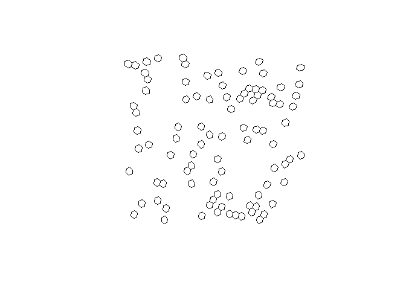

# h3o

<!-- badges: start -->

[](https://github.com/extendr/h3o/actions/workflows/R-CMD-check.yaml)
[](https://CRAN.R-project.org/package=h3o)
[](https://extendr.rs/extendr/extendr_api/)
<!-- badges: end -->

`{h3o}` is a lightweight R package for interacting with [Uber’s H3
Geospatial Indexing system](https://github.com/uber/h3). The R package
uses [extendr](https://extendr.rs/) to wrap the eponymous [h3o Rust
crate](https://crates.io/crates/h3o), which offers a pure Rust
implementation of H3, so no linking to Uber’s H3 C library. The package
is also intended to work with the
[`{sf}`](https://github.com/r-spatial/sf) package for geometric
operations and as a bonus represents the H3 class as
[`{vctrs}`](https://github.com/r-lib/vctrs), so they work seamlessly
within a tidyverse workflow.

## Installation

You can install the release version of `{h3o}` from CRAN with:

``` r
install.packages("h3o")
```

Or you can install the development version from
[GitHub](https://github.com/) with:

``` r
# install.packages("pak")
pak::pak("extendr/h3o")
```

## Example

H3 vectors can be created from `POINT` geometry columns (`sfc` objects)
defined by sf.

``` r
library(h3o)
library(dplyr)
library(sf)
library(tibble)

xy <- data.frame(
  x = runif(100, -5, 10),
  y = runif(100, 40, 50)
)

pnts <- st_as_sf(
  xy,
  coords = c("x", "y"),
  crs = 4326
)

pnts |> mutate(h3 = h3_from_points(geometry, 5))
#> Simple feature collection with 100 features and 1 field
#> Geometry type: POINT
#> Dimension:     XY
#> Bounding box:  xmin: -4.882684 ymin: 40.05321 xmax: 9.888865 ymax: 49.80712
#> Geodetic CRS:  WGS 84
#> First 10 features:
#>                       geometry              h3
#> 1    POINT (6.784454 44.55552) 851f9ad3fffffff
#> 2     POINT (7.45967 45.05904) 851f985bfffffff
#> 3     POINT (4.93601 41.74787) 85396a63fffffff
#> 4    POINT (4.600331 41.49313) 853941a3fffffff
#> 5    POINT (4.811129 46.83189) 851f9503fffffff
#> 6   POINT (-2.283214 44.58426) 851848c3fffffff
#> 7     POINT (8.25868 45.06561) 851f9863fffffff
#> 8    POINT (5.945258 45.71229) 851f9167fffffff
#> 9  POINT (-0.8034847 41.24346) 8539700bfffffff
#> 10   POINT (6.936289 47.17417) 851f83dbfffffff
```

H3 vectors also have an `st_as_sfc()` method which allows conversion of
H3 cell indexes into sf `POLYGON`s.

``` r
# replace geometry
h3_cells <- pnts |>
  mutate(
    h3 = h3_from_points(geometry, 4),
    geometry = st_as_sfc(h3)
  )

# plot the hexagons
plot(st_geometry(h3_cells))
```



H3 cell centroids can be returned using `h3_to_points()`. If `sf` is
avilable, the results will be returned as an `sfc` (sf column) object.
Otherwise it will return a list of `sfg` (sf geometries).

``` r
# fetch h3 column
h3s <- h3_cells[["h3"]]

# get there centers
h3_centers <- h3_to_points(h3s)

# plot the hexagons with the centers
plot(st_geometry(h3_cells))
plot(h3_centers, pch = 16, add = TRUE, col = "black")
```


`H3Edge` vectors representing the boundaries of H3 cells can be created
with `h3_edges()`, `h3_shared_edge_pairwise()`, and
`h3_shared_edge_sparse()`.

``` r
cell_edges <- h3_edges(h3s[1:3])
cell_edges
#> [[1]]
#> <H3Edge[6]>
#> [1] 1141f9adffffffff 1241f9adffffffff 1341f9adffffffff 1441f9adffffffff
#> [5] 1541f9adffffffff 1641f9adffffffff
#> 
#> [[2]]
#> <H3Edge[6]>
#> [1] 1141f985ffffffff 1241f985ffffffff 1341f985ffffffff 1441f985ffffffff
#> [5] 1541f985ffffffff 1641f985ffffffff
#> 
#> [[3]]
#> <H3Edge[6]>
#> [1] 114396a7ffffffff 124396a7ffffffff 134396a7ffffffff 144396a7ffffffff
#> [5] 154396a7ffffffff 164396a7ffffffff
```

We’ve created a list of each cell’s edges. We can flatten them using
`flatten_edges()`.

``` r
cell_edges <- flatten_edges(cell_edges)
cell_edges
#> <H3Edge[18]>
#>  [1] 1141f9adffffffff 1241f9adffffffff 1341f9adffffffff 1441f9adffffffff
#>  [5] 1541f9adffffffff 1641f9adffffffff 1141f985ffffffff 1241f985ffffffff
#>  [9] 1341f985ffffffff 1441f985ffffffff 1541f985ffffffff 1641f985ffffffff
#> [13] 114396a7ffffffff 124396a7ffffffff 134396a7ffffffff 144396a7ffffffff
#> [17] 154396a7ffffffff 164396a7ffffffff
```

These can be cast to sfc objects using `st_as_sfc()`.

``` r
st_as_sfc(cell_edges)
#> Geometry set for 18 features 
#> Geometry type: LINESTRING
#> Dimension:     XY
#> Bounding box:  xmin: 4.638203 ymin: 41.58031 xmax: 7.984481 ymax: 45.31479
#> Geodetic CRS:  WGS 84
#> First 5 geometries:
#> LINESTRING (7.114327 44.3184, 7.191398 44.54827)
#> LINESTRING (6.563495 44.38585, 6.800861 44.23743)
#> LINESTRING (6.800861 44.23743, 7.114327 44.3184)
#> LINESTRING (6.953229 44.697, 6.638788 44.61554)
#> LINESTRING (7.191398 44.54827, 6.953229 44.697)
```

Additionally, you can get the vertexes of H3 cell indexes using
`h3_to_vertexes()` which returns an `sfc_MULTIPOINT`.

``` r
h3_to_vertexes(h3s)
#> Geometry set for 100 features 
#> Geometry type: MULTIPOINT
#> Dimension:     XY
#> Bounding box:  xmin: -5.268602 ymin: 39.86661 xmax: 10.19141 ymax: 49.916
#> Geodetic CRS:  WGS 84
#> First 5 geometries:
#> MULTIPOINT ((6.638788 44.61554), (6.563495 44.3...
#> MULTIPOINT ((7.42549 45.23518), (7.346976 45.00...
#> MULTIPOINT ((4.704843 41.96327), (4.638203 41.7...
#> MULTIPOINT ((4.342076 41.64357), (4.276867 41.4...
#> MULTIPOINT ((4.510629 46.94543), (4.440408 46.7...
```

## Bench marks

Since h3o is written in Rust, it is very fast.

### Creating polygons

``` r
h3_strs <- as.character(h3s)
bench::mark(
  h3o = st_as_sfc(h3s),
  h3jsr = h3jsr::cell_to_polygon(h3_strs)
)
#> # A tibble: 2 × 6
#>   expression      min   median `itr/sec` mem_alloc `gc/sec`
#>   <bch:expr> <bch:tm> <bch:tm>     <dbl> <bch:byt>    <dbl>
#> 1 h3o         450.4µs 494.05µs     1893.    9.85KB     14.6
#> 2 h3jsr        8.31ms   8.85ms      111.     2.7MB     94.6
```

### Converting polygons to H3 cells:

``` r
nc <- st_read(system.file("gpkg/nc.gpkg", package = "sf"), quiet = TRUE) |>
  st_transform(4326) |>
  st_geometry()

bench::mark(
  h3o = sfc_to_cells(nc, 5, "centroid"),
  h3jsr = h3jsr::polygon_to_cells(nc, 5),
  check = FALSE
)
#> # A tibble: 2 × 6
#>   expression      min   median `itr/sec` mem_alloc `gc/sec`
#>   <bch:expr> <bch:tm> <bch:tm>     <dbl> <bch:byt>    <dbl>
#> 1 h3o          4.92ms   5.27ms     185.     22.3KB    13.7 
#> 2 h3jsr       28.35ms  29.47ms      33.6   753.9KB     2.24
```

### Converting points to cells

``` r
bench::mark(
  h3o = h3_from_points(pnts$geometry, 3),
  h3jsr = h3jsr::point_to_cell(pnts$geometry, 3),
  check = FALSE
)
#> # A tibble: 2 × 6
#>   expression      min   median `itr/sec` mem_alloc `gc/sec`
#>   <bch:expr> <bch:tm> <bch:tm>     <dbl> <bch:byt>    <dbl>
#> 1 h3o         105.2µs  123.9µs     7159.      848B    14.0 
#> 2 h3jsr        2.64ms    3.1ms      319.     976KB     8.40
```

### Retrieve edges

``` r
bench::mark(
  h3o = h3_edges(h3s),
  h3jsr = h3jsr::get_udedges(h3_strs),
  check = FALSE
)
#> # A tibble: 2 × 6
#>   expression      min   median `itr/sec` mem_alloc `gc/sec`
#>   <bch:expr> <bch:tm> <bch:tm>     <dbl> <bch:byt>    <dbl>
#> 1 h3o         436.1µs  578.3µs     1506.      848B     15.5
#> 2 h3jsr        1.67ms   1.82ms      501.    67.9KB     12.3
```

### Get origins and destinations from edges.

``` r
# get edges for a single location
eds <- h3_edges(h3s[1])[[1]]
# strings for h3jsr
eds_str <- as.character(eds)

bench::mark(
  h3o = h3_edge_cells(eds),
  h3jsr = h3jsr::get_udends(eds_str),
  check = FALSE
)
#> # A tibble: 2 × 6
#>   expression      min   median `itr/sec` mem_alloc `gc/sec`
#>   <bch:expr> <bch:tm> <bch:tm>     <dbl> <bch:byt>    <dbl>
#> 1 h3o          13.3µs   18.4µs    48790.    7.86KB     14.6
#> 2 h3jsr       636.3µs  774.8µs     1242.   19.82KB     13.0
```
